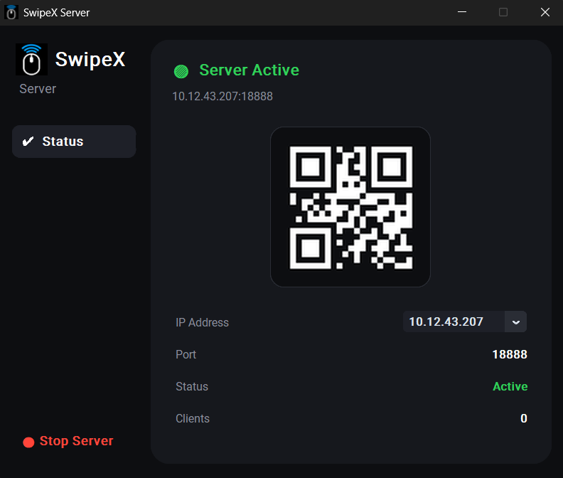
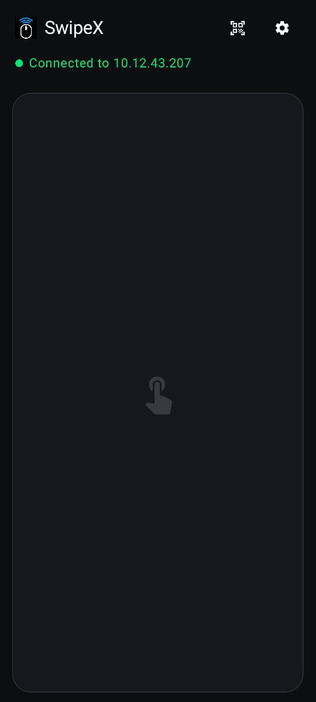
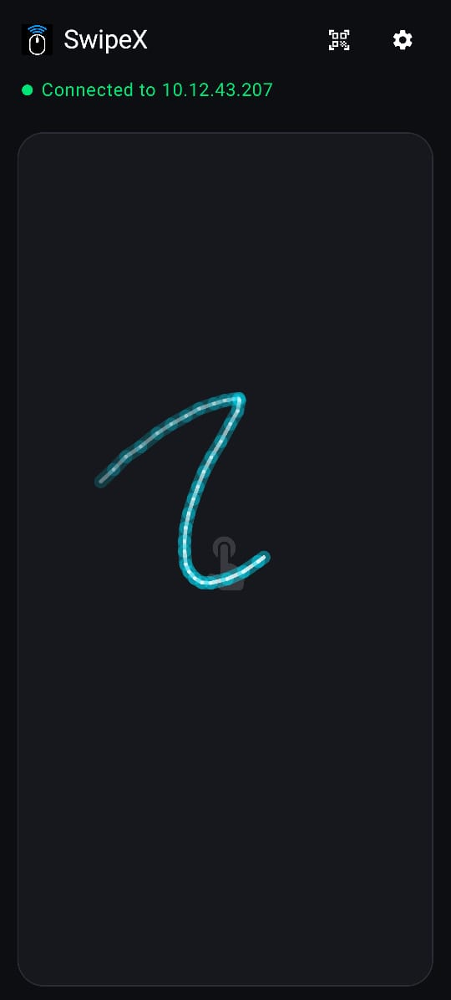
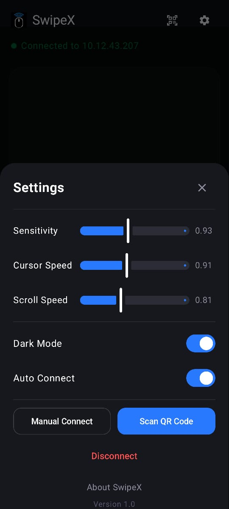

<div align="center">



# SwipeX

### Turn your Android phone into a wireless Windows trackpad

[](Release/SwipeX.apk)
[](Release/SwipeX.exe)
[](LICENSE)

</div>

---

## 📸 Screenshots

<div align="center">

| Touchpad | Active Glow | Settings | Windows Server |
|:---:|:---:|:---:|:---:|
|  |  |  |  |
| *Full-screen touchpad* | *Neon glow trail* | *Settings panel* | *Windows server UI* |

</div>

---

## ✨ Features

- 🖱️ **Smooth cursor control** — Sub-pixel precision with glide interpolation at 500Hz
- 📡 **Wireless & offline** — Works on local Wi-Fi, no internet required
- ⚡ **Instant connect** — QR code scan or auto-discovery over UDP broadcast
- 🌟 **Neon glow trail** — Real-time touch visualization that fades in 1 second
- 📱 **Full-screen touchpad** — Immersive mode with gesture exclusion
- 🖥️ **Tray app** — Windows server runs silently in the background
- ⚙️ **Configurable** — Sensitivity, cursor speed, scroll speed, dark mode

---

## 📦 Download

| Platform | File | Size |
|:---|:---|:---|
| 📱 **Android** | [SwipeX.apk](Release/SwipeX.apk) | ~33 MB |
| 🖥️ **Windows** | [SwipeX.exe](Release/SwipeX.exe) | ~46 MB |

> Both files are fully standalone — no additional runtimes or installs needed.

---

## 🚀 Quick Setup

### 1. Windows — Start the Server
1. Run **SwipeX.exe** — the server starts instantly
2. A SwipeX icon appears in your **system tray** (bottom-right taskbar)
3. Double-click the tray icon to open the dashboard with the **QR code**

### 2. Android — Connect
1. Install **SwipeX.apk** (enable *Unknown Sources* if prompted)
2. Open the app → tap the **QR scanner icon** (top right)
3. Scan the QR code shown on your Windows app
4. ✅ Connected — start using your phone as a trackpad!

### Auto-Reconnect
Once paired, SwipeX remembers your PC. Next time on the same network it reconnects **automatically** — no QR scan needed.

---

## 🖐️ Gestures

| Gesture | Action |
|:---|:---|
| **1 finger slide** | Move cursor |
| **1 finger tap** | Left click |
| **1 finger hold (400ms)** | Click & drag |
| **2 finger slide** | Scroll vertically |
| **2 finger pinch** | Zoom in/out |
| **3 finger swipe** | Window gestures |

---

## ⚙️ Settings

Open Settings from the gear icon (top right of the app):

| Setting | Description |
|:---|:---|
| **Sensitivity** | Touch delta multiplier (0.1 – 2.0) |
| **Cursor Speed** | Overall cursor velocity |
| **Scroll Speed** | Two-finger scroll multiplier |
| **Dark Mode** | Pure black OLED theme |
| **Auto Connect** | Auto-reconnect to last paired PC |

---

## 🔧 Technical Architecture

### Communication
- **Protocol**: WebSocket over local Wi-Fi (port `18888`)
- **Discovery**: UDP broadcast beacon on port `18889`
- **Message format**: Lightweight CSV strings — `m,dx,dy` · `c,button,action` · `s,dy`

### Cursor Smoothing
- **Glide interpolation** — 500Hz background thread drains movement buffer for continuous, jitter-free motion
- **Dynamic smoother** — Adaptive alpha (0.40–0.95) based on speed: high filtering at rest, low filtering during fast movement
- **Sub-pixel accumulator** — Float deltas accumulated before integer conversion for micro-precision

### Stack
| Component | Technology |
|:---|:---|
| Android UI | Jetpack Compose |
| Android Networking | OkHttp WebSocket |
| Windows Server | Python + FastAPI + Uvicorn |
| Windows UI | CustomTkinter |
| Mouse Simulation | Win32 `SendInput` API |
| Packaging | PyInstaller (onefile) + Gradle |

---

## 🏗️ Build from Source

### Android
```bash
cd "swipex android app"
.\gradlew assembleRelease
# Output: app/build/outputs/apk/release/app-release.apk
```

### Windows
```bash
cd "SwipeX Desktop"
python -m PyInstaller SwipeX.spec --clean --noconfirm
# Output: dist/SwipeX.exe
```

> **Requirements**: Python 3.11, JDK 21, Android SDK 35

---

## 📁 Project Structure

```
SwipeX/
├── Release/                  # Built binaries
│   ├── SwipeX.apk
│   └── SwipeX.exe
├── screenshots/              # App screenshots
├── swipex android app/       # Android (Kotlin + Compose)
│   └── app/src/main/java/com/swipex/app/
│       ├── MainActivity.kt
│       ├── SwipeXViewModel.kt
│       ├── screens/          # TouchpadScreen, SettingsScreen
│       ├── touchpad/         # Input handling
│       ├── network/          # WebSocket manager
│       └── gesture/          # Gesture detection
└── SwipeX Desktop/           # Windows server (Python)
    ├── app.py                # Main UI + server
    ├── mouse_controller.py   # Win32 cursor control
    └── tray_icon.py          # System tray
```

---

<div align="center">

Made with ❤️ · SwipeX v1.0

</div>
